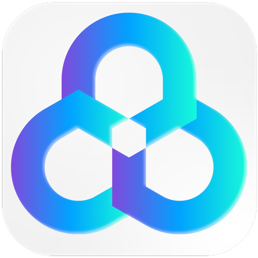
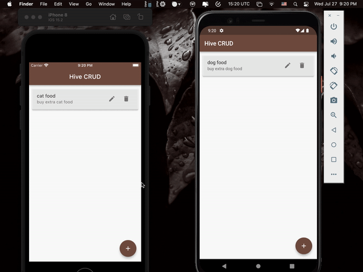

&nbsp;&nbsp;
&nbsp;&nbsp;
<a href="https://choosealicense.com/licenses/mit/" target="_blank"></a>&nbsp;&nbsp;
&nbsp;&nbsp;


# Hive CRUD - [KindaCode](https://www.kindacode.com/article/flutter-hive-database/)

</img>

## App Demo

<p align="center"></p>

## Hive CRUD

Create: [home_page.dart](lib/views/home_page.dart)

```dart
  // Create new item
  Future<void> _createItem(Map<String, dynamic> newItem) async {
    await _shoppingBox.add(newItem);
    _refreshItems(); // update the UI
  }

```

Read: [home_page.dart](lib/views/home_page.dart)

```dart
  // Get all items from the database
  void _refreshItems() {
    final data = _shoppingBox.keys.map((key) {
      final value = _shoppingBox.get(key);
      return {"key": key, "name": value["name"], "quantity": value['quantity']};
    }).toList();

    setState(() {
      _items = data.reversed.toList();
      // we use "reversed" to sort items in order from the latest to the oldest
    });
  }

  // Retrieve a single item from the database by using its key
  // Our app won't use this function but I put it here for your reference
  // ignore: unused_element
  Map<String, dynamic> _readItem(int key) {
    final item = _shoppingBox.get(key);
    return item;
  }
```

Update: [home_page.dart](lib/views/home_page.dart)

```dart
  // Update a single item
  Future<void> _updateItem(int itemKey, Map<String, dynamic> item) async {
    await _shoppingBox.put(itemKey, item);
    _refreshItems(); // Update the UI
  }

```

Delete: [home_page.dart](lib/views/home_page.dart)

```dart
  // Delete a single item
  Future<void> _deleteItem(int itemKey) async {
    await _shoppingBox.delete(itemKey);
    _refreshItems(); // update the UI

    // Display a snackbar
    // ignore: use_build_context_synchronously
    ScaffoldMessenger.of(context).showSnackBar(
        const SnackBar(content: Text('An item has been deleted')));
  }

```

## File Pattern Inside The `lib` Folder

```
lib
├── views
│   └── home_page.dart
└── main.dart
```
